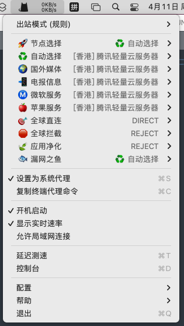

# clashnode [停止更新]

> 由于运营商总是封我IP, 停止更新节点

## 订阅节点

- github

> https://raw.githubusercontent.com/sumwai/clashnode/main/clash.yml

- 国内用户

> https://ghproxy.com/https://raw.githubusercontent.com/sumwai/clashnode/main/clash.yml

## 配置选项

